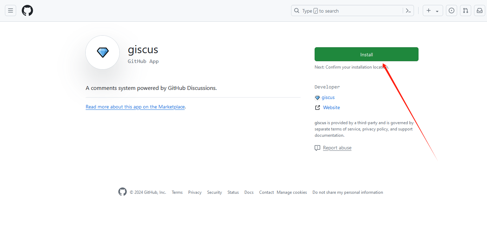
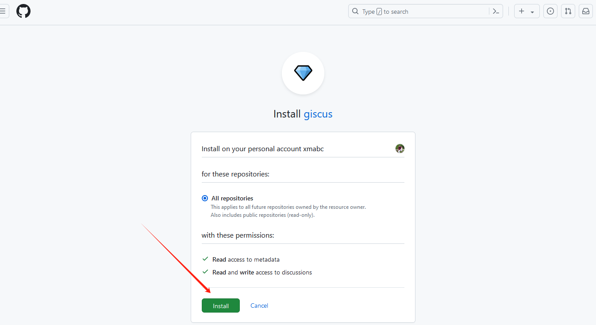

# 评论功能

> [官方文档地址](https://squidfunk.github.io/mkdocs-material/setup/adding-a-comment-system/)

### 第一步：登录github，打开[giscus](https://github.com/apps/giscus)安装giscus






### 第二步：打开页面生成配置源码[giscus](https://giscus.app)


### 第三步：将下面 `comments.html` 中5-20行的代码替换为上面刚刚生成的代码.111


=== "comments.html"

    ```html linenums="1" hl_lines="5-20"
        <!-- Comment system -->
        
          <h2 id="__comments">{{ lang.t("meta.comments") }}</h2>
          <!-- Insert generated snippet here -->
          <script src="https://giscus.app/client.js"
                data-repo="txmabc/txmabc-mkdocs"
                data-repo-id="R_kgDOMD3TBg"
                data-category="Show and tell"
                data-category-id="DIC_kwDOMD3TBs4Cf8VJ"
                data-mapping="title"
                data-strict="0"
                data-reactions-enabled="1"
                data-emit-metadata="0"
                data-input-position="top"
                data-theme="preferred_color_scheme"
                data-lang="zh-CN"
                data-loading="lazy"
                crossorigin="anonymous"
                async>
            </script>
        
          <!-- Synchronize Giscus theme with palette -->
          <script>
            var giscus = document.querySelector("script[src*=giscus]")
        
            // Set palette on initial load
            var palette = __md_get("__palette")
            if (palette && typeof palette.color === "object") {
              var theme = palette.color.scheme === "slate"
                ? "transparent_dark"
                : "light"
        
              // Instruct Giscus to set theme
              giscus.setAttribute("data-theme", theme) 
            }
        
            // Register event handlers after documented loaded
            document.addEventListener("DOMContentLoaded", function() {
              var ref = document.querySelector("[data-md-component=palette]")
              ref.addEventListener("change", function() {
                var palette = __md_get("__palette")
                if (palette && typeof palette.color === "object") {
                  var theme = palette.color.scheme === "slate"
                    ? "transparent_dark"
                    : "light"
        
                  // Instruct Giscus to change theme
                  var frame = document.querySelector(".giscus-frame")
                  frame.contentWindow.postMessage(
                    { giscus: { setConfig: { theme } } },
                    "https://giscus.app"
                  )
                }
              })
            })
          </script>
        

    ```

=== "目录结构"

    ```nohighlight
    .
    ├── docs/
    ├── overrides/
    │   └── partials/
    │       └── comments.html
    └── mkdocs.yml
    ```

=== "文档配置"

    ```md
        ---
        comments: true
        ---
    ```